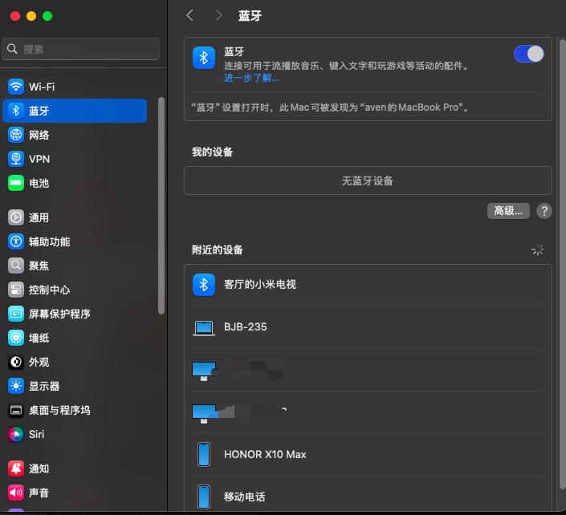
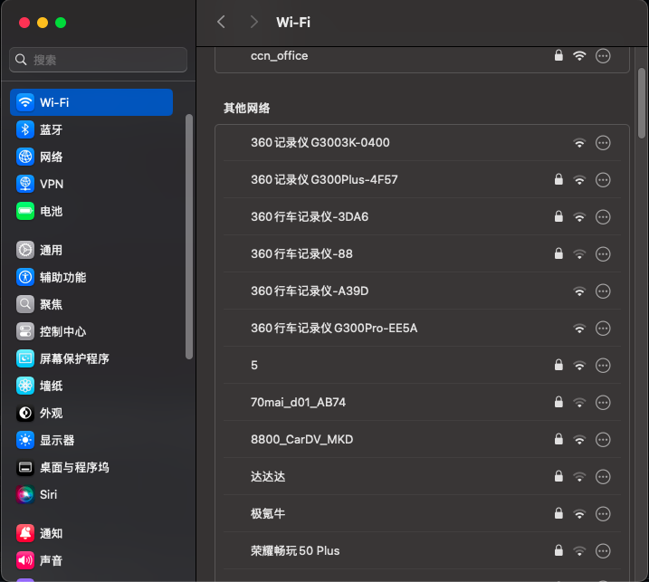

# XiaoMi-Ruby15.6-Hackintosh-OpenCORE
XiaoMi-Ruby15.6-Hackintosh-OpenCORE   (support Sequoia macOS 15.1.x)

此版本EFI支持macOS 11.x/macOS 12.x/macOS 13.x/macOS 14.x/macOS 15.1.x

## 电脑配置信息/Computer configuration

| 规格     | 详细信息                                   							  					|
| -------- | ---------------------------------------------------------					|
| 电脑型号 | 小米笔记本 Ruby 15.6 2019款 集显款(UHD 620)      |
| 处理器  | Intel(R) Core(TM) i5-8250U                      							|
| 内存  | SK hynix 16GB*2 DDR4 2400MHz							|
| 硬盘  | Great Wall GW3500 1TB(M.2 NVME)	|
| 集成显卡  | Intel(R) UHD Graphics 620  (1 GB)          					|
| 内置显示器  | 中电熊猫 ID	NCP002A 1920x1080 IPS 15.6					|
| 外接显示器  | 1920x1080 							        								|
| 声卡     | Realtek ALC256 (M) 											|
| 网卡     | 无线：英特尔AX201	有线：Realtek RTL 8168B				      |
| 触控板   | I2C HID 																	|
| 照相机   | XiaoMi USB 2.0 WebCam 														|
| 读卡器   | Realtek USB 2.0 Card Reader 												|

|Specifications | details|
| -------- | ---------------------------------------------------------					|
|Computer model | Xiaomi notebook Ruby 15.6 "2019 model (UHD 620) |
|Processor | Intel (R) core (TM) i5-8250u|
|Memory | SK hynix 16GB*2 DDR4 2400MHz |
|Hard disk | Great Wall GW3500 1TB(M.2 NVME) |
|Integrated graphics card | Intel (R) UHD graphics 620 (1 GB)|
|Built in display | CLP panda ID |
|External display | 1920x1080|
|Sound card | Realtek alc256 (m)|
|Network card | wireless: Intel AX201; wired: Realtek RTL 8168b |
|Touch panel | I2C hid|
|Camera | Xiaomi USB 2.0 webcam|
|Reader | Realtek USB 2.0 card reader|
## 仿造APPLE型号

- SMBIOS: MacBookPro16,2

```sh
                    'c.          aven@macbook.local
                 ,xNMM.          ------------------
               .OMMMMo           OS: macOS 15.1.1 24B91 x86_64
               OMMM0,            Host: Hackintosh (SMBIOS: MacBookPro16,2)
     .;loddo:' loolloddol;.      Kernel: 24.1.0
   cKMMMMMMMMMMNWMMMMMMMMMM0:    Uptime: 4 hours
 .KMMMMMMMMMMMMMMMMMMMMMMMWd.    Packages: 15 (brew)
 XMMMMMMMMMMMMMMMMMMMMMMMX.      Shell: zsh 5.9
;MMMMMMMMMMMMMMMMMMMMMMMM:       Resolution: 1920x1080, 1920x1080
:MMMMMMMMMMMMMMMMMMMMMMMM:       DE: Aqua
.MMMMMMMMMMMMMMMMMMMMMMMMX.      WM: Quartz Compositor
 kMMMMMMMMMMMMMMMMMMMMMMMMWd.    WM Theme: Blue (Dark)
 .XMMMMMMMMMMMMMMMMMMMMMMMMMMk   Terminal: iTerm2
  .XMMMMMMMMMMMMMMMMMMMMMMMMK.   Terminal Font: Monaco 15
    kMMMMMMMMMMMMMMMMMMMMMMd     CPU: Intel i5-8250U (8) @ 1.60GHz
     ;KMMMMMMMWXXWMMMMMMMk.      GPU: Intel UHD Graphics 620
       .cooc,.    .,coo:.        Memory: 18485MiB / 32768MiB
```

## 注意/attention

1.修复AX201蓝牙在macOS 15.1.x无法驱动的问题

- 涉及的kext驱动

|          kext name          | kext version |           download link            |
| :-------------------------: | :----------: | :--------------------------------: |
|     BlueToolFixup.kext      |    2.6.9     | https://dortania.github.io/builds/ |
|     IntelBTPatcher.kext     |    2.5.0     | https://dortania.github.io/builds/ |
| IntelBluetoothFirmware.kext |    2.5.0     | https://dortania.github.io/builds/ |




- NVRAM配置的参数

|               key               | Data Type |            Value             |
| :-----------------------------: | :-------: | :--------------------------: |
|  bluetoothExternalDongleFailed  |   Data    |              00              |
| bluetoothInternalControllerInfo |   Data    | 000000000000000089653A552EFD |

2.修复AX201 WIFI在macOS 15.1.x无法驱动的问题

- 需要添加 IOSkywalkFamily.kext、IO80211FamilyLegacy.kext、AirportItlwm_v2.3.0_stable_Ventura.kext
- OpenCore-Patcher需要安装1.6.0版本的，才能安装补丁




